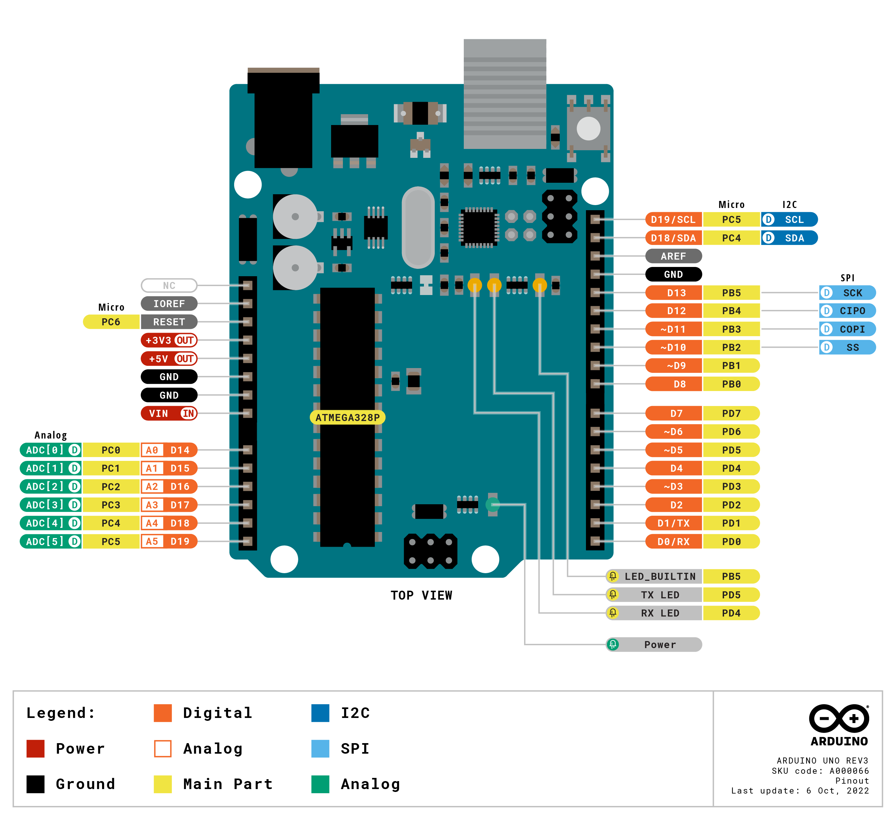
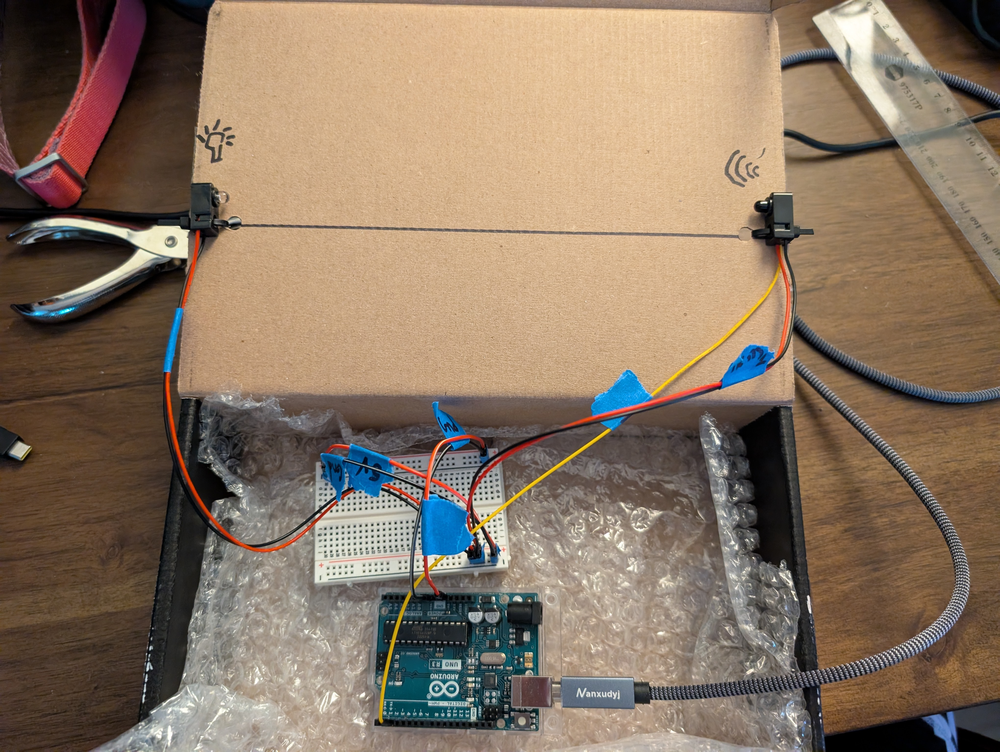
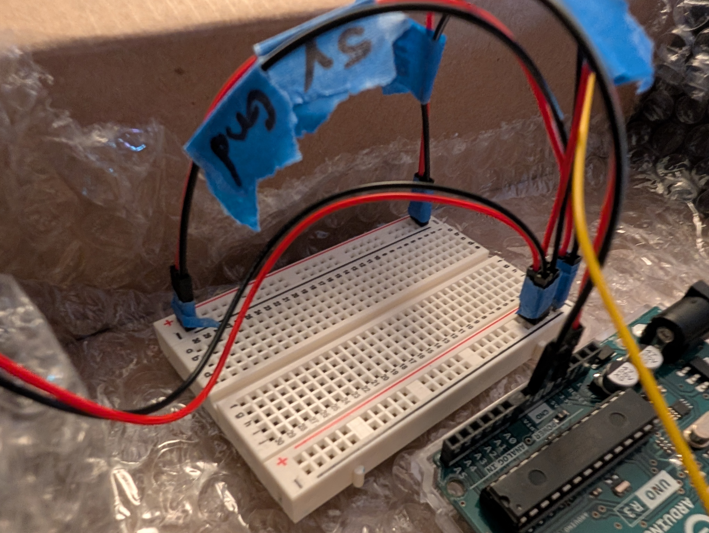
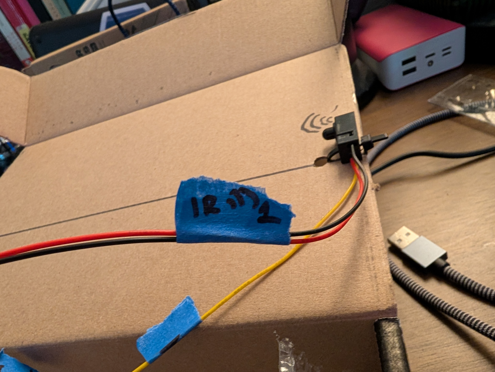
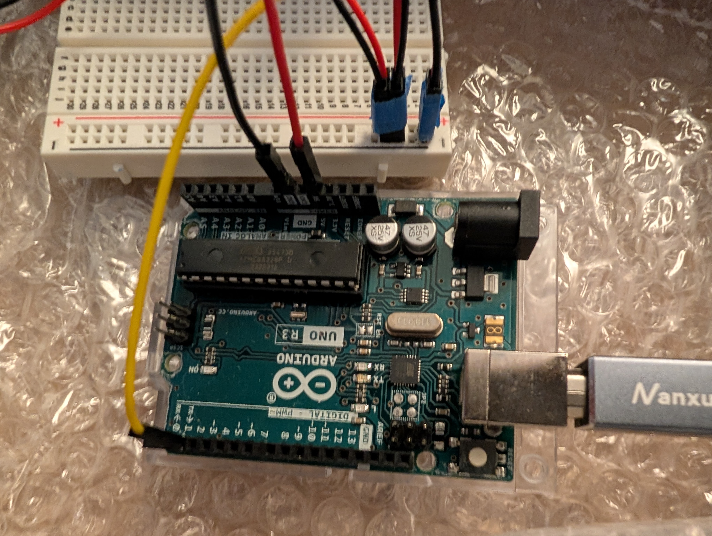
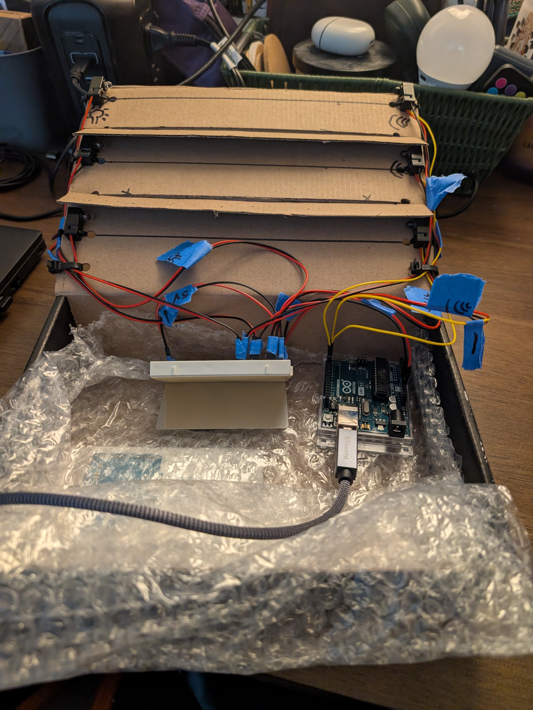

# Snake Racetrack


## Usage Documentation

### Explanation of Arduino


### Conda Setup


### Using the Jupyter Notebook


# Setup


## Software

### Dependencies

- arduino-ide_2.3.10_Linux_64bit
- conda (environment details below)

#### environment.yaml contents

```yaml
name: snakeRacetrack
channels:
- conda-forge
- defaults
dependencies:
- python=3.12
- pip
- setuptools
- ipython
- jupyter
- nb_conda
- notebook<7.0.0
- ffmpeg
- pytables==3.8.0
- cudatoolkit
- pip:
  - -r requirements.txt
```

#### requirements.txt contents

```yaml
glob2
ipynb
matplotlib
numpy
opencv-python
pandas
scikit-learn
scipy
```

## Hardware

### Components (Used / Can Sub (potentially with compilation modifications))
Most parts can be sourced on adafruit or any other electronics maker retailer

- [Arduino Uno REV3 (R3) microcontroller](https://docs.arduino.cc/hardware/uno-rev3/) // any arduino board if you are comfortable with spec sheets, electronics, and potential slight modifications to the code in C
- [9 VDC 1000mA regulated switching power adapter - UL listed](https://www.adafruit.com/product/63) // depends on what microcontroller you pick. Note, 9v should power it fine, as should USB, for this board. Be mindful of heat.
- [IR Break Beam Sensor with Premium Wire Header Ends - 5mm LEDs](https://www.adafruit.com/product/2168) // any IR beam break sensor with positive, negative, and data wires; 5V likely needed for sufficient range
- [Half Sized Premium Breadboard](https://www.adafruit.com/product/64) - 400 Tie Points // any breadboard
- [Male / Male Jumper Wires 22 AWG](https://www.adafruit.com/product/1957) // BUY THE LENGTH YOU NEED, not just what's listed; can sub for spool wire
-[Female to Female Jumper Wires 22 AWG](https://www.adafruit.com/product/4447) // BUY THE LENGTH YOU NEED, not just what's listed; can sub for spool wire
- Painter's Tape (label your wires) and a marker
- if you purchased 5v IR beam break sensors, as above, no need for 

### Documentation

#### Arduino Uno R3

The R3 can safely supply 5V via its own power over USB or a 9V barrel connector. On the data pin side, PIN1 is reserved for serial output and should be ignored, and PIN13 is tied to the on-board LED and you should ignore it unless you're looking to incorporate that LED. That leaves us PIN{2:12} for our sensors, and we only need two through eleven. Pin Layout:




#### Example Prototype

The basic overall structure is:



- A breadboard is used with a jumper line. Paired pin units are taped together with painters tape. The IR beam break sensor comes with five wires across two units; an IR flashlight that sends the beam, with a 3.3V / 5V capable wire (red) and a ground wire (black), and a receiver that includes both, as well a data wire (yellow). In order, here is an up-close view of the bread board:



The bottom lane goes to the arduino; the top lane is for sensors. A jumper connects the two. The jumper line from lane to lane is redundant, but it helps compartmentalize the layout in case you need to make an adjustment (like adding a resistor; the R3 has an onboard resistor that the code employs, instead). With respect to all wires, it is highly recommended that each is labeled with some system that makes sense to you, particularly as it references what the wire does. Small electronics can be sensitive and easy to short out. Here are some examples:




The top lane holds each sensor. I tape the full sensor block together (everything that's sensor one), and internally, I often like to tape the wires for the individual sensors together. The pins are quite fragile, and two is stronger than one, if only slightly. For my own sanity and to avoid pulling the wrong pins, I like to leave a gap of one header's width between each group. The separate connections to the arduino look as follows:



Sensor one goes to pin two on the data line of pins at the bottom of the image. Separetely, the one set of wires coming from the jump line at the bottom of the breadboard is connected to one of the ground terminals and the 5V terminal along the line of pins at the top of the image. On the right side of the image, the barrel would be connected, and the USB cable is connected. The code requires that the USB cable be connected to run, anyway; the barrel is connected, here, since we have one (dedicated power draw). In terms of a completed prototype, some modifications are helpful:



The IR "beam" sensors are really just lightbulbs. Something to prevent crossover (since there's a short distance between them) is almost certainly going to be necessary. Sketch one in the training material will work, but sketch two will choke, otherwise. 

#### Physical Snake Racetrack
